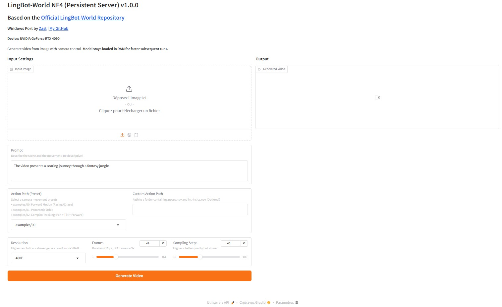
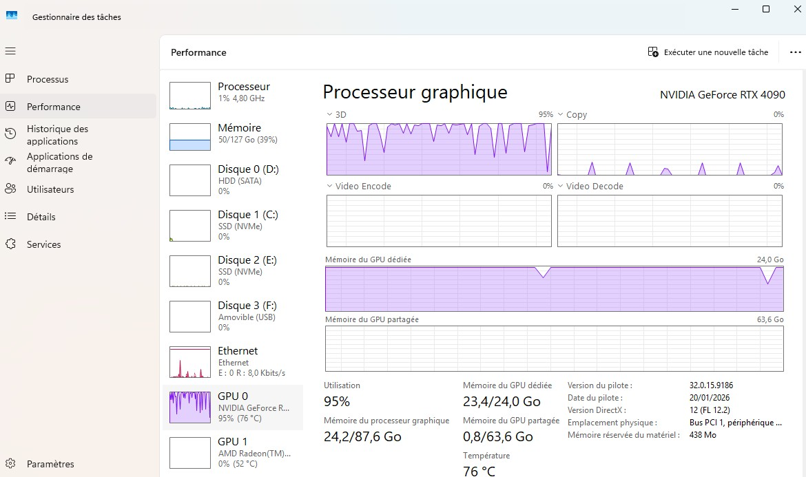

# LingBot-World NF4 (Pinokio Edition v1.0.0)
**Ported by [Zast](https://zast57.com/)** | [Zast's GitHub](https://github.com/zast57) | [Official Repo](https://github.com/Robbyant/lingbot-world)

> [!WARNING]
> **EXPERIMENTAL / UNOFFICIAL**
> This is a community-created installer for Windows. It is **not** affiliated with the original creators. Use at your own risk.

This is a Windows-optimized Pinokio installer for the incredible **[LingBot-World](https://github.com/Robbyant/lingbot-world)** project.

**LingBot-World** is a state-of-the-art World Model for Image-to-Video generation that allows for precise camera control.
Please visit and star the **[Official Repository](https://github.com/Robbyant/lingbot-world)** to support the original researchers and view the full documentation/paper.

## ⚠️ Important Notes

- **Experimental**: This build is a work-in-progress and has been tested **only on Windows with NVIDIA RTX cards**. Use at your own risk. **No support provided.**
- **Windows Optimized**: This version uses bitsandbytes NF4 quantization to run on consumer GPUs (requires ~20-24GB VRAM instead of the original heavy requirements).
- **Gradio Interface**: We have added a custom Gradio web interface (`app_gradio.py`) for easier interaction, replacing the command-line interface.
- **No Keyboard Control**: The real-time keyboard controls from the original repository **do not work** in this web-based version. All interactions are handled through the Gradio UI.
- **Visual Glitch**: The "Generating video frame" cursor/progress bar may not display correctly, but the generation is still running in the background.

## Requirements

- NVIDIA GPU (24GB VRAM recommended, minimum 20GB with quantization)
- ~50GB disk space
- Windows 10/11

## 🚀 How to Install

1. Download [Pinokio](https://pinokio.computer) if you haven't already.
2. Open Pinokio and navigate to the **Discover** page.
3. Paste this repository URL into the search bar (or drag and drop the URL).
4. Click **Download**.

## Usage

1. Click **Install** to set up the environment.
2. **IMPORTANT**: Click **Download Models** to fetch the necessary model weights (~28GB).
3. Once the download is complete, click **Start** to launch the Gradio interface.
4. The interface will open automatically in your browser at `http://127.0.0.1:7860`.

## 🎮 How to Use
1. **Upload First Frame**: Upload an image to serve as the start of the video.
2. **Enter Prompt**: Describe the scene or action you want to generate.
3. **Select Action Path (Preset)**: Choose a camera movement preset from the dropdown:
   - `examples/00`: **Forward Motion** (Ideal for racing cars, moving ahead)
   - `examples/01`: **Zoom In/Out** (Forward/backward motion)
   - `examples/02`: **Custom Pan/Tilt** (Generic camera movement)
   - *Note: These are pre-calculated camera trajectories.*
   - **Custom Paths**: You can also enter a path to your own camera pose folder (must contain `poses.npy` and `intrinsics.npy`).
4. **Advanced Settings** (Optional):
   - **Resolution**: Output size (e.g., `480*832` for vertical, `832*480` for horizontal, etc.). Higher resolutions require more VRAM.
   - **Frame Num**: Number of frames to generate (default: 81).
   - **Sampling Steps**: Quality of generation (default: 40). Higher is slower but better.
5. **Generate**: Click the button and wait.
   - Generation can take **several minutes** (depending on resolution and GPU).
   - This version is slower than the original due to intense VRAM optimization (NF4).
   - The video will appear on the right side once complete.

## 🖼️ Gallery & Examples

### Racing Car (Forward Motion)
> *Preset: examples/00*
> *Prompt: A fast racing car driving on the track.*

[Watch Video](carrace.mp4)

### Dragon (Zoom/Orbit)
> *Preset: examples/01*
> *Prompt: A dragon flying over a medieval castle.*

[Watch Video](dragon.mp4)

### Model VRAM Usage

## Models Used

- **cahlen/lingbot-world-base-cam-nf4**: NF4 quantized weights (~19GB)
- **robbyant/lingbot-world-base-cam**: VAE + T5 encoder (~9GB)

## Credits

- Original Repository: [Robbyant/lingbot-world](https://github.com/Robbyant/lingbot-world)
- Model by [Robbyant](https://huggingface.co/robbyant/lingbot-world-base-cam)
- NF4 Quantization by [cahlen](https://huggingface.co/cahlen/lingbot-world-base-cam-nf4)
- **Pinokio Port & Gradio UI by [Zast](https://zast57.com/)**
